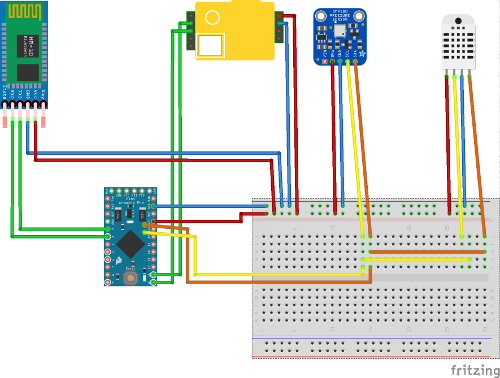
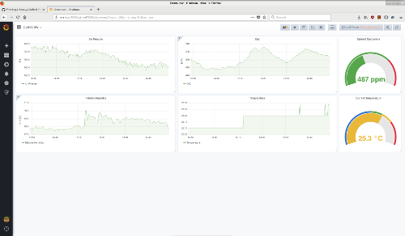

### Ardunino air quality monitoring
This projects aims to create a air quality monitoring setup with inexpensive components.
The data is collected using the following sensors:  
- BMP180 (Air pressure, Temperature)
- MH-Z19B (Co2 concentration)
- SMT20 (Humidity, Temperature)



The collected data is sent via Bluetooth (HM-10 Module) to an receiver (a Intel-NUC in my case) and visualized using a Grafana Dashboard.



### Project Structure
| Folder       | Description                                                                                                                  | Remarks                                                                                                                        |
|--------------|------------------------------------------------------------------------------------------------------------------------------|--------------------------------------------------------------------------------------------------------------------------------|
| `Fritzing`   | The Fritzing projcet                                                                                                         | Get fritzing here:[https://fritzing.org/home/](https://fritzing.org)                                                           |
| `additional` | Datasets for the sensors                                                                                                     |                                                                                                                                |
| `arduino`    | Ardunio libraries and source code.                                                                                           | This is a platfrom-io project. More info [https://platformio.org/](here)                                                       |
| `grafana`    | Just the exported `grafana` dashboard                                                                                        |                                                                                                                                |
| `python`     |  Python files: Write data values to the influx db (`data_logger.py`) and   scan for new advertisement packets (`scanner.py`) |  There is `requirements.txt` file present, which use to   install all required packages: ```pip install -i requirements.txt``` |
### Technology Stack
- Data is stored in a Influx-DB
- A Grafana-Dashboard is used to display the measured values
- Scripting language at the receiver-side is Python `3.6`
- The data is transmitted using iBeacon `UUID-String` (yes this is a hack see more info below)


### Data transmission
As mentioned above the collected data is transmitted using Bluetooth Low Energy to
the receiver. Generally speaking, the data is transmitted using the advertisement
data:
```
Index         :        7   11 13   15     19 21   23 25                  39
                       |    |  |    |      |  |    |  |                   |
Example string: 4c000215 0190 1b   27   03c9 27   a0 a0   0000000 000000 2d       ffe0ffe1 c5
Labels        : Ibeacon  co2  temp.temp pres.pres hum.hum ------- ------ checksum other_stuff
```
However, since the HM-10 does not support changing the advertisement data
directly, I had to _abuse_ the iBeacon mode where you can change 32 Bytes of the `UUID-String`. To make things worse (more interesting!), the BLE-Module only allows you to
change 8 Bytes of the `UUID-String` at once. For example the `AT` command for the first 8 Bytes:
```
AT+IBE0AABBCCDD # As a side-note: all Hex-Characters have to be upper-case
```
And you guessed it, you can't control **when** an advertisement package is sent.
This the reason the checksum is needed :)

### Future work, remarks and problems
- Currently only one temperature value is evaluated. However, all sensors measure
temperature, therefore we could compare them and even create some sort of a _confidence-interval_
- If you power on the whole circuit, the first _valid_ (according to the checksum) transmitted value of the co2-sensor is sometimes way off (in the 5-6k area)
- Don't buy the components on aliexpres or similar. I've wasted (too) many hours figuring out that for example the HM-10 Module was a clone of a _clone_ of the original.
- Feedback, ideas and PR's welcome :)
